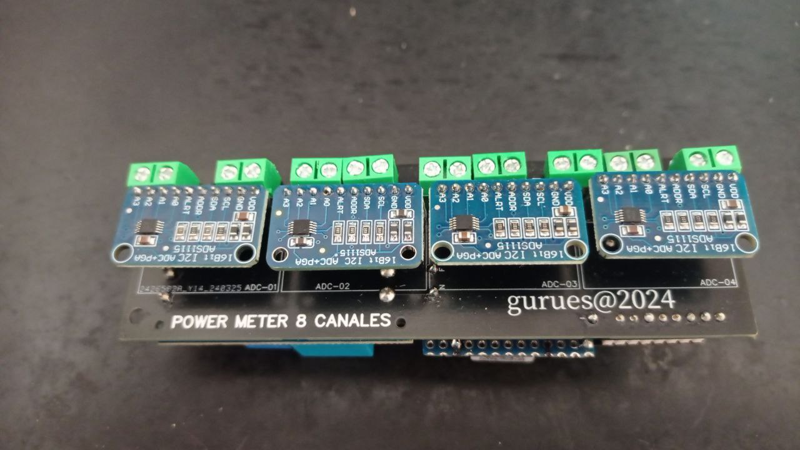

# MEDIDOR DE PONTENCIA A/C DIY (Power Meter DIY 8 canales)

## ANTECEDENTES

### En su día realice un medidor de potencia de 4 canales,`https://github.com/gurues/PowerMeterDIY`, pero me faltaba implementar la medida de la tensión en el mismo dispositivo. Este nuevo dispositivo utilliza el sensor de voltaje AC ZMPT101B para medir la tensión VAC de la red. Además realice el diseño de la placa electrónica así como su soporte para carril DIN.

___



## DESCRIPCIÓN DEL PROYECTO

### Para la realización del Power Meter DIY de 8 canales necesitaremos los siguientes componentes:

* 1 x ESP32-CE SUPERMINI (microcontrolador) ~ 4€
* 4 x ADS1115 (convertidor analógico digital de 16 bits) ~ 10€
* 7 x SCT-013-030 (pinza - sensores de corrientes no invasivos, máxima 30A, relación 30A/1V) ~ 28€
* 1 x SCT-013-050 (pinza - sensores de corrientes no invasivos, máxima 50A, relación 50A/1V) ~ 4€
* 1 X ZMPT101B (sensor de voltaje) ~ 2€
* 1 x F.A HI-LINK3.3V-5W (Fuente de alimentación) ~ 5€
* 5 x placa powermeterdiy-8 (placa electrónica) ~ 10€

### El coste total del medidor de potencia de 8 canales es de unos 65 euros.

### Mediante ESPHome se configuran el dispositivos Power Meter DIY 8, creando las siguientes entidades en Home Assistant:

* Sensor de Potencia Wifi del Power Meter DIY 8. Me da una idea de como es la conexión con la red WIFI del dispositivo
* Sensor de Consumo para cada canal del Power Meter DIY 8. Proporciona una salida en tensión proporcional a la intensidad medida que mediante la programación con ESPHome muestra la salida en amperios de cada canal. En mi caso el sensor de 30A/1V para circuitos normales y el sensor de 50A/1V para la medición de la entrada principal a mi casa. Estos sensores se necesitan calibrar.  
* Sensor tensión diferencial entre canales del ADS1115 para cada canal del Power Meter DIY 8. Recibe la señal en voltios proporcionada por las pinzas SCT-013-030 y SCT-013-050. Esta señal puede ser positiva y negativa al medir corriente alterna. Estas entidades no las muestro en Home Assistant porque no aportan un valor añadido al dispositivo, aunque son las que necesitamos mirar para la calibración de los sensores SCT-013-030 y SCT-013-050.
* Sensor de tensión de entrada a la casa. ZMPT101B. Mediante este sensor realizo la medida de tensión de entrada VAC. El valor obtenido es usado para los cálculos de potencia. Este sensor es necesario ajustar y calibrar.
* Sensor de Potencia para cada canal del Power Meter DIY 8. Cada 15 segundos calculo la potencia instantánea de cada canal del dispositivo, mediante multiplicación de los valores de los sensores de consumo y tensión de entrada.

## CALIBRACIÓN DE LAS PINZAS AMPERIMÉTRICAS (SCT-013-030 y SCT-013-050)

### Seguí las instrucciones que hay en ESPHome, `https://esphome.io/components/sensor/ct_clamp.html`. Calibré cada pinza con un consumo constate de 8.3A y 10A (radiador eléctrico de aceite). Ajuste el parámetro "calibrate_linear" para obtener los 8.3A y 10A en los canales de consumo del Power Meter DIY 8. El parámetro "calibrate_linear" inicial se obtiene de las medidas obtenidas por los ADS1115 que proporcionan las salida en tensión proporcional a la intensidad (PowerMeterDIY_8_1_ADS1115 A0-A1, PowerMeterDIY_8_1_ADS1115 A2-A3, PowerMeterDIY_8_2_ADS1115 A0-A1, PowerMeterDIY_8_2_ADS1115 A2-A3, PowerMeterDIY_8_3_ADS1115 A0-A1, PowerMeterDIY_8_3_ADS1115 A2-A3 y PowerMeterDIY_8_4_ADS1115 A0-A1, PowerMeterDIY_8_4_ADS1115 A2-A3). Durante todo el proceso de calibración contraste la medida del Power Meter DIY 8 con una pinza amperimétrica Fluke calibrada. Los resultados obtenidos son sorprendentemente precisos (ver fotos del montaje para calibración).

```Arduino
filters:
      - calibrate_linear: # Relación pinza 1V/30A
          # Valor inical
          - 0.0 -> 0.0
          - 0.325 -> 8.3   (0.325 es un valor muy cercano al valor que muestras el sensor PowerMeterDIY_8_1_ADS1115 A0-A1)
          - 1.0 -> 30.0
```

## CALIBRACIÓN SENSOR DE VOLTAJE (ZMPT101B)

### Seguí las instrucciones que hay en este proyecto de Github,`https://github.com/danpeig/ESP32EnergyMonitor/tree/main`. Como resumen es necesario medir un voltaje de 220 VAC y mediante el potenciometro que trae el sensor ajustar la señal de salida obtenida en el Serial Plotter para que sea lo más senoidal posible.

### Una vez ajustado el potenciometro del sensor es necesario ajustar el valor de sensibilidad del mismo, para obtener una medida de tensión correcta. Yo ajuste este valor midiendo en paralelo el voltaje con un multímetro FluKe. Mi valor de sensibilidad es 823. Este valor se le debes introducir en el archivo de configuración power-diy-8.yaml.

```Arduino
    //ESP_LOGD("custom", "Lambda");         // Mensaje de depuración
    static ZMPT101B zmpt_sensor(4, 50.0);   // sensor como estático para que persista su valor entre llamadas lambda
        if (!id(initialized)){                     // Calibracion sensor - se ejecuta 1 vez
            zmpt_sensor.setSensitivity(823.0f);    // Ajustar para obterner el valor correcto de Tensión Alterna
            id(initialized) = true;
            //ESP_LOGD("custom", "Calibrado sensor..."); // Mensaje de depuración
        }
        if (id(initialized)) {                     // Obtener el valor RMS del sensor y publicarlo
            float rms_voltage = zmpt_sensor.getRmsVoltage();
            id(voltaje).publish_state(rms_voltage);
        }
```

## INDICACIONES DE FUNCIONAMIENTO

### El dispositivo tarda unos 5 minutos en estabilizar su arranque y mostrar unos valores de tensión, consumo y potencia instantanea correctos. 

## AYUDA PARA EL MONTAJE

### Toda la información necesaria para realizar este proyecto se comparte en este repositorio y la puedes encontrar organizada en las siguiente carpetas o archivos:

* Archivo power-diy-8.yaml. Aquí tienes la configuración ESPHome del Power Meter DIY 8. Aquí puedes modificar el nombre del dispositivo, la ip fija, ajuste de calibración y los parámetros de programación de ESPHome.
* Archivo secrets.yaml. Aquí tienes que configurar tus datos WIFI, etc.
* Carpeta Ayuda_Montaje. En esta carpeta tienes fotos del dispositivo, esquema de montaje, placa electronica y archivos para su fabricación.También están en la carpeta 3D, los STL's para la instalación del Power Meter DIY 8 en carril DIN (es posible que tengas que ajustarlos un poco .... yo le tuve que pasar la lima).

## ENLACES Y AGRADECIMIENTOS

* `https://www.luisllamas.es/arduino-sensor-corriente-sct-013/`
* `https://www.luisllamas.es/entrada-analogica-adc-de-16-bits-con-arduino-y-ads1115/`
* `https://forum.jeedom.com/viewtopic.php?t=41112#p671120`
* `https://esphome.io/`
* `https://esphome.io/components/sensor/ct_clamp.html`
* `https://www.thingiverse.com/thing:4625751`
* `https://github.com/r3mko/ZMPT101B/tree/master`
* `https://github.com/danpeig/ESP32EnergyMonitor/tree/main`

* Un Loco y su Tecnología, `https://www.youtube.com/channel/UC2zp7AWsYhZaGmYTjP8hZ7A`. Por su magnífico canal de Youtube donde comparte todos sus conocimientos

* `https://www.luisllamas.es/`. El mejor bloc para aprender a cacharrear con Arduino, ESP8266, ESP32 y mucho más

## Realizado por gurues (gurues@3DO ~ 2024 ~ ogurues@gmail.com)